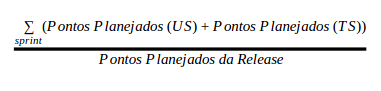
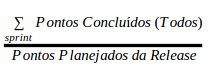
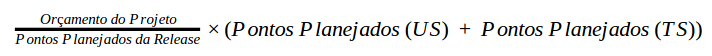
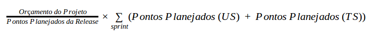
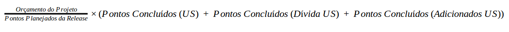
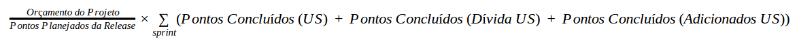
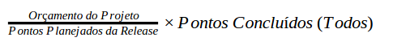
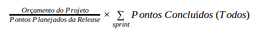

# 1. Acompanhamento da EVM (Earned Value Management)
A EVM pode ser encontrada com seu desenvolvimento em tempo real [aqui](https://docs.google.com/spreadsheets/d/1wU-TGfiVB6OY84-vCvqgftFxlfYRqcV_2YKkJzEjgBU/edit?usp=sharing)

# 1.1.Definições iniciais
Conforme o [Termo de Abertura](https://github.com/fga-gpp-mds/2017.1-SIGS/wiki/Termo-de-Abertura-do-Projeto), o projeto todo teve um orçamento de recursos humanos de R$ 36.563,40 e ao fim da Release 1 em seu [Relatório de Custos](https://github.com/fga-gpp-mds/2017.1-SIGS/wiki/Relatorio-de-Custos) foi gasto com recursos humanos o valor de R$ 13.466,55 sobrando assim como orçamento de recursos humanos para a Release 2 o montante de R$ 22.178,85. Contudo, por interesse da cliente, foram adicionadas novas histórias e o tempo foi aumentado para a produção deste. A cliente então irá fornecer bolsa para 7 (sete) dos membros com a continuação do projeto até o mês de dezembro, tendo como folga não remunerada o mês de julho. Logo, cada membro com bolsa terá um custo de R$400.00 por mês contados entre agosto e dezembro, contabilizando R$2.000,00 por membro. Elevando o orçamento de recursos humanos para R$36.178,85.

Todo o custo da Release foi feito sobre a definição de esforço. Esta definição foi feita internamente sob o aspecto de esforço necessário para o desenvolvimento das funcionalidades. Essa medida de esforço é apenas uma estimativa baseada no empirismo do time. O esforço mais básico é cotado como "1 ponto" e a partir dele é efetuado a estima de esforço para cada funcionalidade que deve ser implementada. A estimativa foi feita utilizando a técnica do _Planning_ _Poker_ e o esforço necessário para cada história planejada pode ser encontrado em nosso [Backlog do Produto](https://github.com/fga-gpp-mds/2017.1-SIGS/wiki/Backlog-do-Produto).

Foi feito para definição do custo, o valor do ponto que é baseado sob a razão do orçamento da release pelo somatório do total de pontos.

Caso o time efetue a repontuação das histórias, o somatório dos pontos será alterado e consequentemente o valor do ponto.

# 2. Tipos de Pontos em uma Sprint
* **Pontos** **Planejados** **(US):** São todos os pontos de _User_ _Stories_ que foram planejadas serem feitas na _Sprint_;
* **Pontos** **Planejados** **(TS):** São todos os pontos de _Techinical_ _Stories_ que foram planejadas serem feitas na _Sprint_;
* **Pontos** **Adicionados** **(Dívida US):** São todos os pontos de _User_ _Stories_ que são pendencias de _Sprints_ anteriores;
* **Pontos** **Adicionados** **(Dívida TS):** São todos os pontos de _Techinical_ _Stories_ que são pendencias de _Sprints_ anteriores;
* **Pontos** **Adicionados** **(US):** São apenas _User_ _Stories_ que são adicionadas durante a _Sprint_ e não foram planejadas.

# 3. Cálculos:

* **Porcentagem** **Planejada** **Concluído** **do** **Projeto:**

* **Porcentagem** **Real** **Concluído** **do** **Projeto:**

* **Custo** **Planejado** **da** **Sprint:**

* **Custo** **Planejado** **do** **Projeto:**

* **Valor** **Agregado** **da** **Sprint:**

* **Valor** **Agregado** **do** **Projeto:**

* **Custo** **Real** **da** **Sprint:**

* **Custo** **Real** **do** **Projeto:**

# 4. Justificativa dos Cálculos

## 4.1. Valor Planejado
Para a equipe ficou definido que o valor planejado deve quantificar todos os pontos planejados (que não são dívidas) que foram adicionados na _Sprint_ na reunião de planejamento. Sendo assim os pontos que são utilizados para este cálculo são: **Pontos** **Planejados** **(US)** e **Pontos** **Planejados** **(TS)**. As TS entram no planejado, pois é um esforço que o time terá que fazer para a conclusão da _Sprint_ e este esforço na reunião de planejamento já é considerado.

## 4.2. Valor Agregado
O valor agregado é considerado apenas pontos que em sua entrega criem um impacto funcional no cliente e que não seja fruto de historias geradas devido a falhas de desenvolvimento (TS). Sendo assim os pontos que são utilizados para este cálculo são: **Pontos** **Planejados** **(US)**, **Pontos** **Adicionados** **(Dívida US)** e **Pontos** **Adicionados** **(US)**.

## 4.3. Valor Real
Para o calculo do valor real foram utilizados todos os pontos concluídos do projeto. Tomamos esta definição do calculo, pois assumimos que o valor real é dado sobre o esforço do time. Como todos os pontos concluídos refletem no esforço que o time teve até o momento, foi definido ele para o cálculo do valor real.

# 5. Custo da Release
