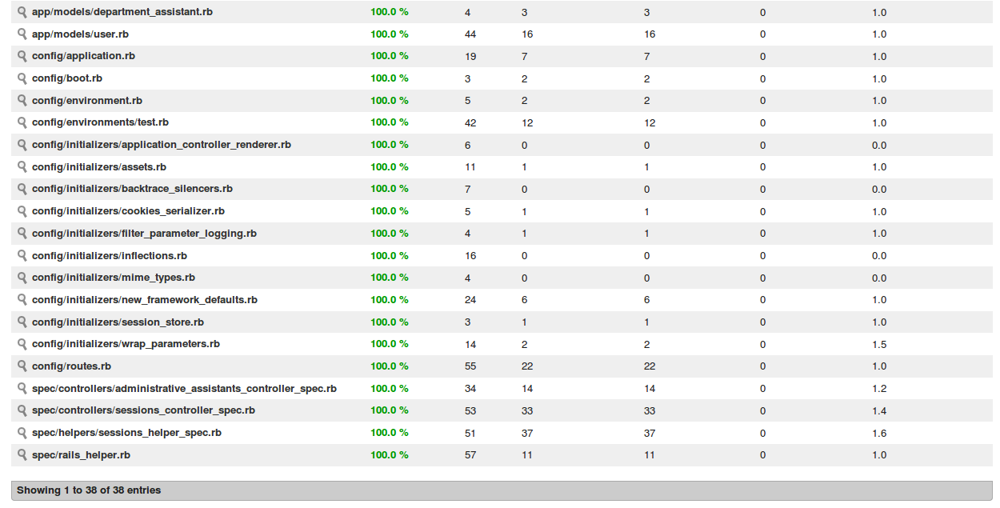
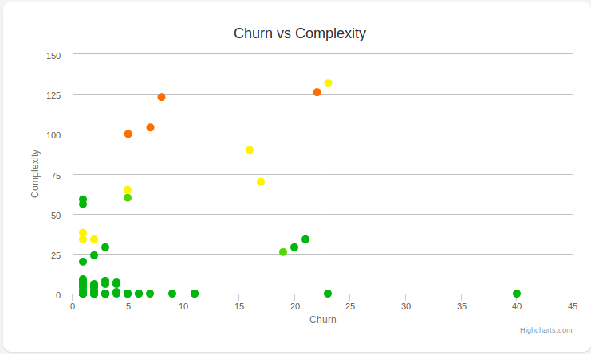
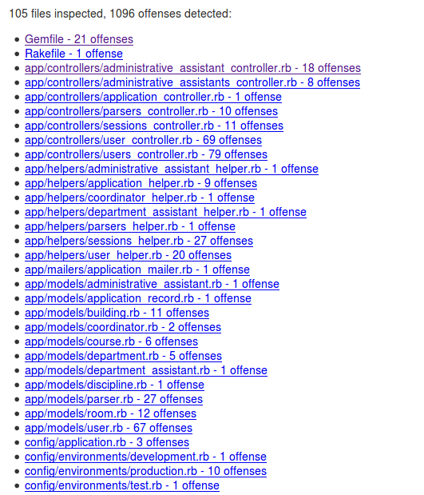
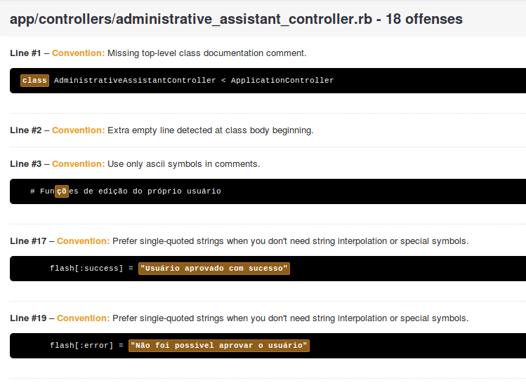
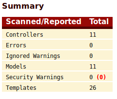
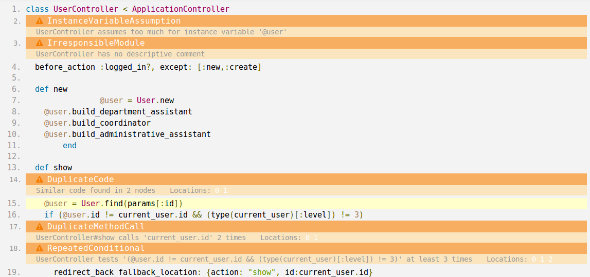

### Histórico de Revisões

| Data      | Versão | Descrição     | Autor   |
|:---------:|:------:|:-------------:|:-------:|
|**19/04/2017** |  0.1   | Descrição dos resultados obtidos após execução do plano de qualidade | Caio Nunes |
----------

# 1. Iteração 1

Nessa iteração não foram coletadas métricas pelo fato de se tratar da fase de iniciação do projeto, e não ter sido desenvolvido nenhum código.

# 2. Iteração 2

Nessa iteração não foram coletadas métricas pelo fato de ter sido iniciada a fase de Elaboração do projeto, onde a arquitetura do mesmo estava sendo moldada e não foi desenvolvido nenhum código.

# 3. Iteração 3

Abaixo encontram-se as métricas relativas à iteração 3, onde foram desenvolvidos os seguintes casos de uso:

* __Gerenciar Usuário__
* __Solicitar Cadastro__
* __Aprovar Cadastro__
* __Manter Sessão__

Vale ressaltar que nem todos os arquivos do projeto serão considerados nas tomadas de decisões derivadas da coleta e análise das métricas, devido ao fato da convenção sobre configuração do Rails gerar diversos arquivos que não são modificados diretamente pelos desenvolvedores, mas podem ter problemas acusados pelas ferramentas de análise de código.

## 3.1 Cobertura de testes

De acordo com o contexto das disciplinas, é necessário que na entrega da Release 1 ( R1 ) a cobertura de teste seja de, no mínimo, 30 %. De acordo com as métricas coletadas nesse ponto do projeto, a cobertura de teste era de 84%.

Entretanto, a proposta da equipe era de ter conseguido a cobertura máxima de 100% em relação aos casos de uso que foram entregues. Por isso, durante a Sprint 0, a equipe definiu atividade de elaboração dos testes, para alcançar a cobertura proposta.

## 3.2 Complexidade Ciclomática (_Flog_) e Duplicações de Código (_Flay_)

A tabela abaixo (1) mostra os indicadores de complexidade e duplicação de código de todos os arquivos considerados para análise de qualidade:

|          Arquivo        |Flog|Flay|
|-------------------------|----|---|
|users_controller.rb      |16.5|32 |
|parsers_controller.rb    |13.0|155|
|parser.rb                |12.0|68 |
|application_controller.rb|0   |0  |
|sessions_controller.rb   |11.3|0  |
|department_assistants_controller.rb|0 | 0 |
|coordinators_controller.rb|0  |0  |
|administrative_assistants_controller.rb|5.2|0|
|sessions_helper.rb       |5.8|0   |
|department_assistant_helper.rb|0|0|
|application_helper.rb    |8   | 0 |
|coordinator_helper.rb    |0   | 0 |
|user_helper.rb           |6   | 0 |
|administrative_assistant_helper|0 | 0 |
|parsers_helper.rb        |0   | 0 |
|discipline.rb            |0   | 0 |
|course.rb                |0   | 0 |
|administrative_assistant.rb|0 | 0 |
|user.rb                  |0   |34 |
|department.rb            |0   | 0 |
|department_assistant.rb  |0   | 0 |
|room.rb                  |2   | 0 |
|coordinator.rb           |0   | 0 |
|building.rb              |4   | 0 |

Pela análise dos dados encontrados, identifica-se que não existe necessidade de refatoração no âmbito da complexidade, mas é extremamente necessária refatoração para redução dos índices de duplicação de códigos identificados. Com isso, serão definidas atividades de refatoração destas classes.

## 3.3 Turbulência (*Churn* x Complexidade)

Visualizando o gráfico, podemos ver alguns potenciais pontos de refatoração que devem ser tratados. Estes pontos são:
UsersController
SessionsControllerSpec
SessionsHelperSpec
Schema
Routes

Os outros arquivos monitorados indicam uma quantidade baixa ou mediana de modificações, mas isso se dá pela necessidade de alterações nesses arquivos para construção da arquitetura do sistema, e a tendência é que esse índice naturalmente reduza ou mantenha-se estável, sendo apenas uma necessidade do sistema.

Entre os arquivos monitorados, 3 deles (SessionsControllerSpec, SessionsHelperSpec e Schema) são arquivos de teste ou configuração/banco de dados. O “Schema” é representa a estrutura do banco de dados que é gerado pela aplicação, e não cabe refatorar este arquivo a nível de complexidade. Em relação a quantidade de alterações, isto deve-se ao fato da arquitetura do sistema e o banco de dados terem sido moldados, e esse índice será reduzido naturalmente. Em relação aos outros dois arquivos de teste, são classes de testes da aplicação, e sua complexidade não será considerada para análise da qualidade do produto. Em relação a quantidade de modificações, este arquivo está sujeito a ter uma oscilação nos índices de acordo com que os respectivos arquivos a que eles estão ligados (SessionsController e SessionsHelper) são alterados, surgindo a necessidade de novos testes.

O arquivo “Routes” indica níveis altos de modificações, e isso é justificado devido a adição de novas rotas em relação ao crescimento da aplicação. Entretanto, pode significar também imaturidade da equipe de desenvolvido em relação a tecnologia escolhida, e por isso faremos análise com a própria equipe a fim de sanar dúvidas em relação a tecnologia e reduzir este indicador conforme for possível.

O gráfico nos mostra ainda uma alta complexidade no arquivo UsersController, e uma alta quantidade de alterações no mesmo. Por isso os esforços serão focados em analisar diretamente este ponto e refatorá-lo no que for necessário.

## 3.5 Checkstyles

Baseado na folha de estilo do projeto, foi definido um arquivo de configuração para a ferramenta Rubocop, que identifica as definições elaboradas e trás uma avaliação baseada nelas. Com isso, o grupo pode acompanhar a qualidade do código em relação a padronização e aplicação da folha de estilo. O resultado da análise é:

Devido a configuração elaborada para o Rubocop, muitos destes arquivos serão desconsiderados, pois foram gerados pela convenção sobre configuração do Rails, e não agregam em relação a qualidade. Com esses resultados, serão definidas atividades de refatoração da folha de estilo.

## 3.6 Falhas de Segurança

De acordo com a ferramenta, não foram identificados _warnings_ de segurança nas _controllers_ e _models_ exploradas

## 3.7 *Smells*

De acordo com o relatório gerado pela ferrament RubyCritic, várias “smells” foram identificadas no projeto, indicando possíveis pontos de refatoração. Foram consideradas Smells nos mesmos arquivos da tabela 1.

Diversas *"smells"* foram identificadas pela ferramenta *Rubycritic*, de forma a fazer apontas em relação ao código. Vamos considerar alguns desses apontamentos dentro dos arquivos que estamos monitorando, desde que eles indiquem mudanças que realmente afetarem a qualidade do projeto em relação a manutenibilidade.

## 4. Considerações Finais

De acordo com as métricas coletadas e as análises feitas, a decisão será de definir diversas atividades de refatoração, bem como treinamentos para auxiliar a equipe a não cometer os mesmo erros, de forma a melhorar ao máximo a manutenibilidade do projeto no começo da troca de metodologia.
