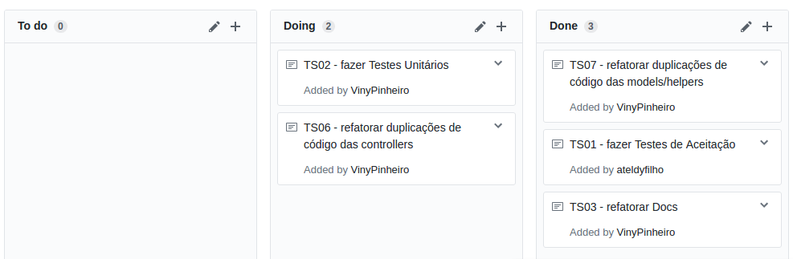

Essa é a metodologia adotada no início da release e poderá sofrer mudanças. Essas mudanças serão apresentadas na sprint que ocorreu no link **Planejamento** na sessão **Mudanças** quando houver.

# 1. Scrum

## 1.1. Papéis
Papéis no desenvolvimento de software significa uma ocupação, uma responsabilidade. Cada papel representa uma parte da metodologia ágil e isso faz com que ela funcione. Cada papel tem responsabilidades distintas onde todos juntos fazem com que as diversas partes dessa metodologia funcionem harmoniosamente.

Os papéis utilizados serão:

- **Scrum Master:** Será representado a cada Sprint por um membro, preferencialmente aluno de GPP. O Scrum Master é responsável por garantir que os princípios do Scrum sejam seguidos, auxiliar o time com problemas que estejam afetando a equipe e garantir o bom desenvolvimento da sprint, acompanhando, cobrando e solucionando problemas que os desenvolvedores estejam tendo. O Scrum Master precisa estar presente, full-time, para o Time de desenvolvimento e para o Product Owner. Estando presente o mesmo sabe na hora dos obstáculos que podem impedir o trabalho do time, garantindo entrega de valor.

- **Product Owner:** Será representado por um membro da equipe que será responsável pelo contato com os _stakeholders_, trazendo informações de decisão e auxilio para o time. O Product Owner gerencia o backlog, priorizando-o e atualizando-o, valida os incrementos do produto a cada Sprint, escreve junto aos _stakeholders_ as _User_ _Stories_ e desenvolve para os _stakeholders_ o processo que ditam as _User_ _Stories_ da Sprint corrente.

- **Tracker:** Será representado a cada Sprint por um membro, preferencialmente aluno de GPP.  O Tracker acompanha, nos _pull_ _requests_, a qualidade de código, verificando as métricas, a qualidade dos testes e com isso dando o _feedback_ constante para que os desenvolvedores possam em seus entregáveis terem maior qualidade de código evitando atividades futuras de refatoração. Sua função é também auxiliar o time para atingir a qualidade de código esperada e auxiliar o _Scrum_ _Master_ nas tomadas de decisão.

- **Time de Desenvolvimento:** Será representado pela equipe de GPP e MDS. O Time é responsável por desenvolver as histórias de usuário, testá-las, coletar e analisar métricas de código a fim de garantir a qualidade do produto, se autogerenciar através dos eventos do Scrum (Planejamento, Retrospectiva e Review da Sprint, além da Reunião Diária) e dos kanbans, quadros de conhecimento, pareamento, presença, entre outros.

## 1.2. Daily Meeting
As reuniões diárias ocorrerão segundo a disponibilidade do **Scrum** **Master** da _sprint_ corrente, sendo que estas serão comunicadas no dia anterior de sua ocorrência e deverão acontecer todos os dias exceto sábado, pois é nossa reunião semanal, e domingo, pela dificuldade de encontro do time.

## 1.3. Sprint Review
A _sprint_ _review_ ocorrerá todos os sábados às 9h:00 na UnB - campus Gama. Nela ocorrerá o fechamento da sprint corrente, abordando os resultados da sprint e sua retorspectiva.

# 2. XP
## 2.1. Pareamento
A técnica de pareamento não será sempre obrigatória. Ela será aplicada apenas para o nivelamento de conhecimento do time. Ela não será obrigatória para que o time tenha uma maior liberdade de desenvolvimento em casos onde o encontro da dupla não seja possível, tendo em vista o âmbito acadêmico, onde nem todos os membros tem todos os dias livres.

## 2.2. Integração Contínua
Para a integração contínua será utilizado o travis-ci, que implementa a verificação do build e do teste unitário. Ele será executado em todas as _branchs_ do projeto e pode ser acompanhado [aqui](https://travis-ci.org/fga-gpp-mds/2017.1-SIGS/)

# 3. Kanban
Foi utilizado o kanban para que o time pudesse ter um controle e monitoramente melhor do fluxo de trabalho. A ferramenta adotada foi o [project](https://github.com/fga-gpp-mds/2017.1-SIGS/projects/1) deste github. O fluxo foi dividido em _To_ _do_ que é onde estavam as atividades planejadas para a _sprint_ corrente, _Doing_ que é onde as atividades em andamento estavam, atividades em andamento englobam protótipo, desenvolvimento, testes e revisão. O _Done_ são as atividades concluídas, revisadas e aprovadas pelo _Product_ _Owner_.

