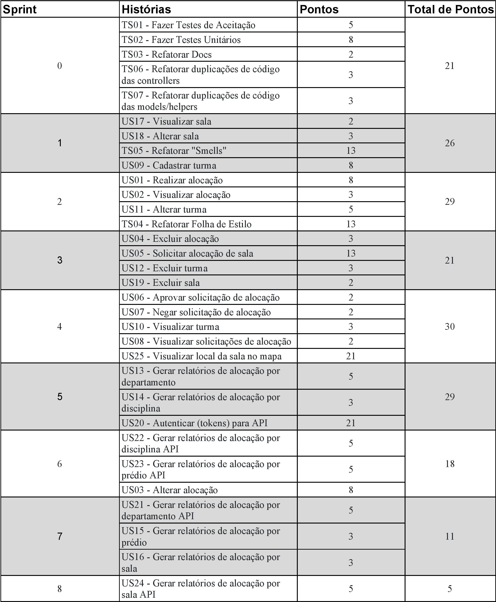
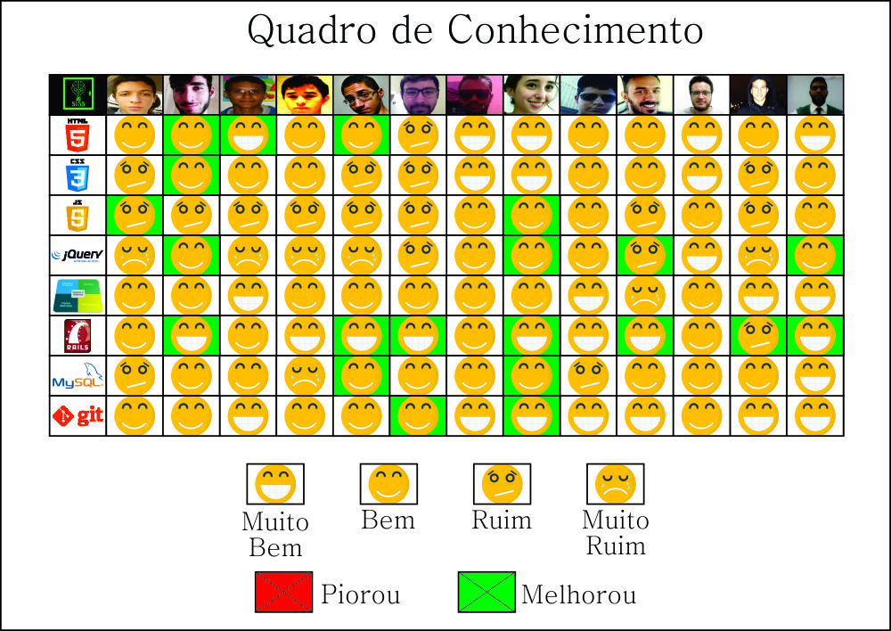

| Data       | Responsável          |Versão   | Mudança realizada                            |  
|------------|----------------------|---|--------------------------------------------------- |
|**24/04/17**| Vinícius Carvalho    | 0.1  | Criação do Planejamento e descrição dos papéis  |
|**25/04/17**| Vinícius Pinheiro    | 0.2  | Adicionando o Quadro de conhecimentos inicial   |
|**28/04/17**| Vinícius Carvalho    | 1.0  | Ajuste no Planejamento   |
|**08/05/17**| Vinícius Pinheiro    | 2.0  | Correção na definição dos papéis e dos épicos,features e user stories   |

## 1. Planejamento da Release

**Duração da Relase:** De 24/04 à 23/06

**Quantidade de Sprints:**  8 sprints

**Definição de Pronto:** Será utilizado o conceito de "pronto" quando as histórias de usuário estiverem testadas (testes unitários e de aceitação), dentro dos valores aceitáveis das métricas e solicitado _pull request_ na branch devel.

## 2. Épicos, Features e Histórias de Usuário

### 2.1 Épicos
Épico é um composto por _Features_ e representam macro entregáveis do projeto, são como marcos deste.

Serão abordados 2 épicos:
* [EP01] Coordenação de Alocação
* [EP02] API

### 2.2 Features
Feature representa um agrupamento de _User_ _Stories_ e _Technical_ _Stories_ comuns que por seu tamanho não é implementada como _User_ _Storie_.

Serão abordados 5 Features:
* [EP01FE01] gerenciar alocações
* [EP01FE02] manter Turma
* [EP01FE03] Gerar relatório
* [EP01FE04] Gerenciar salas
* [EP02FE05] Fazer API

### 2.3 Histórias de Usuário e Histórias Técnicas
Uma história de usuário (_User_ _Stories_) são pequenas funcionalidades que compõem o sistema final e que serão implementadas.

Uma história técnica (_Technical_ _Stories_) são atividades que não agregam valor diretamente para o cliente, mas que são efetuadas para melhoria interna do software, melhorando, por exemplo, a manutenibilidade.

|Histórias de Usuário|Histórias Técnicas|Total de Histórias|
|---|---|---|
|25|07|32|

Todas as histórias podem ser localizadas em nosso [Backlog do produto](Backlog-do-Produto)

## 3. Roadmap
Para melhor organização do time, foi definido o Roadmap inicial do projeto, tendo assim um controle sob as metas de cada sprint.

As últimas sprints planejadas tem uma carga menor, tendo em vista a possibilidade de atrasos e necessidade de adição de histórias técnicas, atitudes que podem gerar atrasos.

[Clique aqui para visualizar maior](images/roadmap_inicial.jpg)

## 4. Conhecimento

### 4.1. Quadro de conhecimento inicial

[Clique aqui para visualizar maior](images/conhecimento_R1.jpg)

### 4.2. Quadro de conhecimento final

[Clique aqui para visualizar maior](images/conhecimento_R2.jpg)
