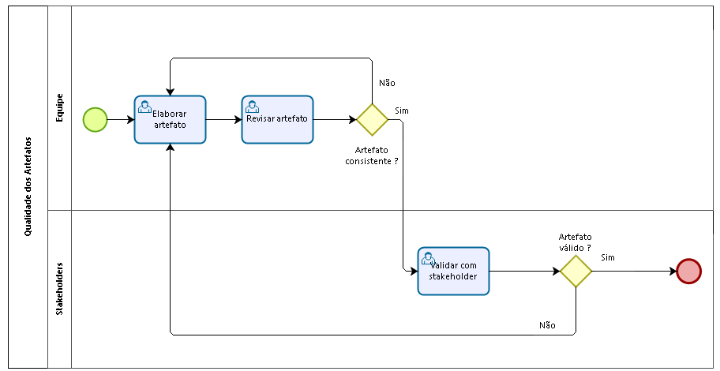
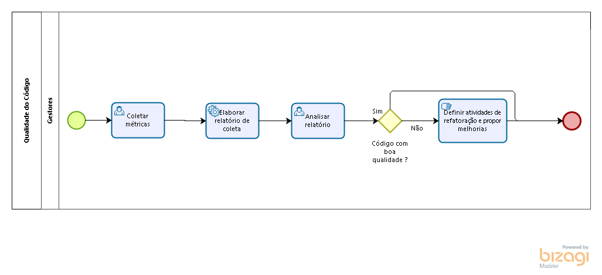

### Histórico de Revisões

| Data      | Versão | Descrição     | Autor   |
|:---------:|:------:|:-------------:|:-------:|
|**24/03/2017** |  0.1   | Introdução    | Vinicius Carvalho |
|**26/03/2017** |  0.2   | Gerenciamento de Qualidade    | Vinicius Carvalho |
|**30/03/2017** |  0.3   | Elaboração dos processos de qualidade dos artefatos e código| Caio Nunes |
|**30/03/2017** |  0.4   | Métricas    | Vinicius Carvalho |
|**31/03/2017** | 0.5    | Descrição das ferramentas| Caio Nunes |
|**03/03/2017**| 1.0     | Revisão do documento de qualidade| Caio Nunes, Vinicius Carvalho |
-----

[1. Introdução](#1-introdução)  

[2. Processo de qualidade](#2-processo-de-qualidade)

* [2.1 Qualidade dos artefatos](#21-qualidade-dos-artefatos)
* [2.1 Qualidade do código](#21-qualidade-dos-artefatos)

[3. Frequência da análise de qualidade](#3-frequência-da-análise-de-qualidade)

[4. Ferramentas](#4-ferramentas)

[5. Métricas](#5-métricas)

[6. Referências Bibliográficas](#6-referências-bibliográficas)

-----

### 1. Introdução

O gerenciamento de qualidade tem como objetivo assegurar que o projeto satisfaça as necessidades do cliente durante todo seu ciclo de vida. Qualidade está relacionada à conformidade com os requisitos e adequação ao uso. Logo, a qualidade é definida pelo cliente. Este documento tem por objetivo descrever o planejamento e gerenciamento de qualidade que irá ocorrer durante a execução do projeto.

#### 1.1 Objetivo do documento
O plano de gerenciamento de qualidade define requisitos e padrões aplicáveis ao projeto e as suas entregas, descrevendo como será verificado a conformidade das mesmas e respeitando a política de qualidade definida pela empresa.

### 2. Gerenciamento de qualidade
Gerenciar a qualidade do projeto requer um plano de qualidade aprovado,englobando os principais processos definidos abaixo. Este plano é desenvolvido e aprovado durante a fase de planejamento do projeto.

#### 2.1 Qualidade dos artefatos

* __Elaborar artefato :__ Essa atividade consiste no desenvolvimento de um novo artefato a ser elaborado ou refatorado/refeito, de acordo com a necessidade, sendo efetuada pela equipe de desenvolvimento ou pelos gestores.

* __Revisar artefato :__ Essa atividade consiste na revisão do artefato gerado, pela equipe de gestão.

* __Validar com Stakeholder :__ Essa atividade consiste na validação do artefato com os stakeholders, para identificar se existem inconsistências e problemas em relação ao artefato.

#### 2.2 Qualidade do código

* __Coleta das métricas :__ Essa atividade consiste na coleta das métricas do código produzido, através das ferramentas definidas neste plano.

* __Elaborar relatório de coleta :__ Essa atividade consiste na análise das métricas coletadas e elaboração de um relatório referente a esta análise.

* __Analisar relatório :__ Essa atividade consiste na análise do relatório elaborado para enfatizar os pontos de melhoria do código.

* __Definir atividades de refatoração e propor melhorias :__ Essa atividade consiste na definição das atividades de refatoração dos pontos identificados no relatório, e proposta de melhorias para impedir novos erros.

#### 2.3 Garantia de qualidade do projeto
A cada ciclo concluído do projeto serão observados as lições aprendidas e o valor que cada processo agregou na qualidade das entregas e na melhoria dos indicadores monitorados. Os processos serão revisitados e monitorados a fim de garantir sua eficiência e evitar desvios das metas estipuladas. Para isto, o processo de melhoria contínua baseia-se o ciclo PDCA (_Plan-Do-Check-Act_).

O ciclo PDCA consiste em quatro fases, conforme a seguir:
* Plan (Planejamento) – responsável por estabelecer metas e objetivos para serem alcançados e padronização dos procedimentos que serão utilizados;
* Do (Execução) – fase de implementação do planejamento, momento responsável por coletar os dados, que serão avaliados posteriormente na fase de verificação;
* Check (Verificação) – esta fase é responsável por verificar se a meta planejada foi devidamente alcançada, nesta fase, utiliza-se de ferramentas que apoiam na verificação, exemplo: ferramenta de controle e acompanhamento, histogramas, folhas de verificação etc.;
* Act (Ação corretiva) – fase que consiste em buscar as causas e prevenir efeitos indesejados e adotar padrões de processos que apoiaram as próximas etapas do projeto.

Desta forma, além de promovermos a melhoria contínua dos processos, também buscaremos a satisfação gradativa do cliente.

### 3. Frequência da Análise de Qualidade
A análise de qualidade de código é um processo contínuo. Sendo assim, a cada artefato que precise ser elaborado, ao fim de cada iteração que contemple desenvolvimento,ao final de cada sprint, os processos de qualidade de artefatos e de código serão seguidos, para assegurar que o plano de qualidade seja seguido e que o produto final atenda às espectativas do cliente de maneira efetiva.

### 4. Ferramentas
As ferramentas de qualidades serão utilizadas para verificação das métricas definidas por este plano, sendo executadas de acordo com a frequência de análise também definidas.

#### 4.1 Rubocop
O foco desta ferramenta é localizar más práticas de programação, com base no Ruby Style Guide, um guia de recomendação de boas práticas de programação ruby. As métricas utilizadas pelo rubocop são adaptáveis ao projeto, tendo então algumas de suas práticas adaptadas a Stylesheet do projeto.

#### 4.2 Breakman
O foco desta ferramenta é localizar possíveis vulnerabilidades de segurança no código. Devido ao escopo do projeto ter diferentes níveis de autorização para utilização do sistema, é interessante verificar estes problemas e corrigir na medida do possível.

#### 4.3 Rubycritic
O foco desta ferramenta é identificar e mensurar métricas pré-definidas. Ela será executada ao fim de cada iteração/sprint a fim de identificar pontos de melhorias do código.

#### 4.4 SimpleCov
O foco desta ferramenta é mostrar a cobertura de código baseado na execução da switch de testes elaborada pelos desenvolvedores. A ferramenta apresenta uma representação gráfica de quais trechos de códigos foram testados ou não.

### 5. Métricas de Código
Métricas são sistemas de mensuração que quantificam uma tendência, comportamento ou variável de negócio, permitindo medir e avaliar o desempenho de qualquer ação.

| Métricas | Descrição |
|:--------:|:---------:|
| Cobertura de Testes | Valor percentual que mede quanto do código é coberto pelos testes automatizados. |
| Flog | Estima a Complexidade Ciclomática do código. |
| Flay | Procura por duplicações de código e similaridades estruturais. |
| Churn  | Quantifica o número de vezes que um arquivo sofreu alterações.  |
| Checkstyle  | Checa se o código fonte está de acordo com as regras de codificação da linguagem.  |
| Falhas de Segurança  | Localização de potenciais falhas de segurança no código.  |

Estas métricas serão avaliadas durante a fase de codificação do projeto, e as especificações das métricas e indicadores se encontram no [plano GQM](https://github.com/fga-gpp-mds/Grupo---7-GPP-MDS/wiki/Plano-GQM).

Para execução das métricas, os seguintes comandos são executados:

1. Rubycritic

Comando: rubycritic
Saída: na pasta tmp/rubycritic, arquivo "overview.html" que mostra a análise da ferramenta.

2. Rubocop

Comando: rubocop --format html -o <nome_desejado>.html.  
Saída: Arquivo "<nome_desejado>.html" no diretório onde o comando foi executado.  

3. Brakeman
Comando: brakeman -o <nome_desejado>.html
Saída: Arquivo "<nome_desejado> .html" no diretório onde o comando foi executado.

### 6. Referências Bibliográficas
* PMI. Um guia do conhecimento em gerenciamento de projetos. Guia PMBOK 5a. ed. - EUA: Project Management Institute, 2013.
