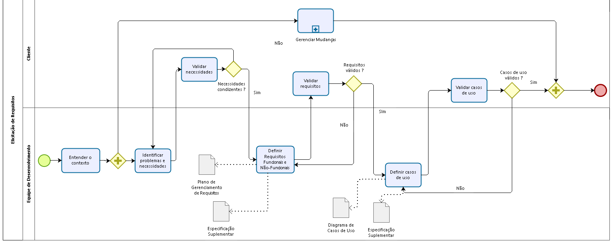
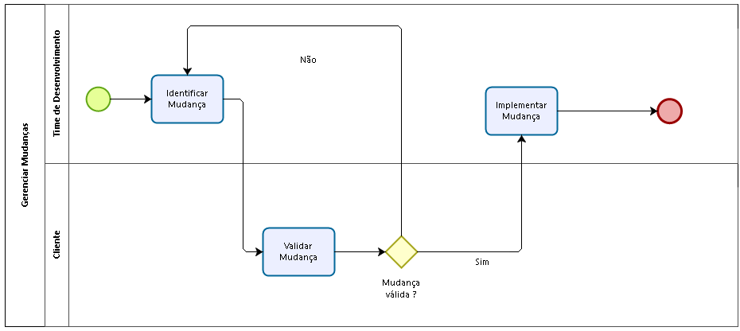

### Histórico de Revisões

| Data      | Versão | Descrição     | Autor   |
|:---------:|:------:|:-------------:|:-------:|
|**21/03/2017**| 0.1  | Inserção do tópico Introdução  | Vinícius Carvalho |  
|**13/04/2017**| 0.2  | Adição do processo e do gerenciamento dos requisitos | João Paulo Busche e Caio Felipe |
|**18/04/2017**| 1.0  | Finalização do Plano de Gerenciamento de Requisitos | João Paulo Busche |
|**19/04/2017**| 1.1  | Revisão do Plano de Gerenciamento de Requisitos | João Paulo Busche |

-----

[1. Introdução](#1-introdução)   
[2. Processo de coleta e de documentação dos requisitos](#2-processo-de-coleta-e-de-documentação-dos-requisitos)   
[3. Gerenciamento de priorização e configuração dos requisitos](#3-gerenciamento-de-priorização-e-configuração-dos-requisitos)   
[4. Matriz de rastreabilidade](#4-matriz-de-rastreabilidade)   
[5. Descrição dos Elementos da Matriz](#5-descrição-dos-elementos-da-matriz)      
[6. Referências bibliográficas](#6-referências-bibliográficas)   

-----

### 1. Introdução
Este documento descreve os requisitos e seus tipos, como também relata como será feito a coleta de informações dos requisitos do produtos usado para avaliar, relatar e controlar mudanças. Os tópicos abortados serão processo de coleta e documentação dos requisitos, gerenciamento de priorização e configuração dos requisitos e a matriz de rastreabilidade e sua descrição.

#### 1.1 Finalidade
Este documento tem como finalidade demonstra como será feito o plano de gerenciamento de requisitos do projeto Sistema de Inteligente de Gestão de Sala (SIGS), descrevendo como o projeto irá configurar o documento de requisitos, quais são os tipos de requisitos como também sua rastreabilidade.

#### 1.2 Definições, Acrônimos e Abreviações
SIGS - Sistema Inteligente de Gestão de Sala  
UnB - Universidade de Brasília.

### 2. Processo de Coleta e de Documentação dos Requisitos
Os requisitos deverão ser coletados baseado no processo abaixo e classificados nos seguintes níveis de rastreabilidade:
* __Problema:__ São os níveis mais alto de abstração dos requisitos, geralmente descrevem qual a causa, que levou a ser requisitado uma solução de software.  
* __Necessidades:__ São as causas que geram os requisitos, geralmentes descrevem contextos onde visam resolver determinado problema.  
* __Requisitos Funcionais e Não-Funcionais:__ São os requisitos que mapeiam as funcionalidades de um sistema, baseados nas necessidades do problema.  
* __Casos de Uso:__ São os requisitos de níveis mais baixos de um sistema, geralmente caracterizados como as ações que um usuário terá no sistema.

#### 2.1 Descrição das Atividades do Processo

##### 2.1.1 Processo "Elicitação de Requisitos"

* __Entender o contexto:__ Refere-se à atividade de conhecer o contexto do cliente, área de atuação do sistema, formas de realização, etc.

* __Identificar problemas e necessidades:__ Refere-se à atividade de analisar o processo de trabalho do cliente dentro do seu contexto, identificar falhas, gargalos e pontos de melhoria, mapeando-as em grandes problemas, e quebrando-os em necessidades que precisam ser supridas para solução dos mesmos.

* __Validar necessidades:__ Refere-se à atividade de apresentar as necessidades levantadas para o cliente, afim de identificar questões que não são realmente pertinentes ao contexto desejado, ou a falta de alguma necessidade que precise ser suprida.

* __Definir requisitos funcionais e não-funcionais:__ Refere-se à atividade de quebrar as necessidades em requisitos de software, tanto em níveis funcionais quanto em níveis não-funcionais, rastreando-os às suas respectivas necessidades e problemas.

* __Validar requisitos:__ Refere-se à atividade de apresentar os requisitos levantados para o cliente, afim de identificar erros ou falta de determinados requisitos essenciais para suprir as necessidades levantadas.

* __Definir casos de uso:__ Refere-se à atividade de analisar os requisitos e quebrá-los em casos de uso, de forma a obter funcionalidades a serem implementadas pela equipe de desenvolvimento.

* __Validar casos de uso:__ Refere-se à atividade de apresentar o diagrama de casos de uso, de forma a possibilitar uma visão operacional do sistema ao cliente, permitindo que ele avalie se atingiu todos os pontos esperados.

##### 2.1.2 Subprocesso "Gerenciar Mudanças"

* __Identificar Mudança:__ Refere-se à atividade de identificar mudanças a partir de determinadas necessidades do cliente que podem, por ventura, vir a ser inseridas ou retiradas do sistema.

* __Validar Mudança:__ Refere-se à atividade de apresentar a nova proposta de mudança ao cliente em todos os níveis de abstração dos requisitos, a fim de validar a nova proposta.

* __Implementar Mudança:__ Refere-se à atividade de realmente efetuar a mudança em relação a rastreabilidade dos requisitos, diagramas e referentes.

### 3. Gerenciamento de Priorização e Configuração dos Requisitos
A priorização dos requisitos é efetuada a partir dos esclarecimentos prestados pelo cliente a respeito dos principais problemas encontrados, e como eles se relacionam entre si. Visto isso, a equipe é capaz de identificar quais requisitos serão priorizados em detrimento de outros.

Os indicadores que manterão a navegabilidade e a rastreabilidade serão representados pelas letras P, que representa os problemas, N, que representa as necessidades do projeto, RF, que representa os requisitos funcionais do sistema e por fim UC que representa os casos de uso do software a ser implementado. Os indicadores serão incrementais, assim possibilitando a sua rastreabilidade, por exemplo o caso de uso  possui uma ligação com o requisito RF1.1.1, que possui ligação com a necessidade N1.1, que possui ligação com o problema P1.

### 4. Matriz de Rastreabilidade

### 5. Descrição dos Elementos da Matriz

#### 5.1 Problemas
| Identificador | Nome | Descrição |
|---|---|---|
| P1 | Alocação de Salas Ineficiente | Este problema representa a ausência de uma alocação de salas feita de maneira eficiente onde o processo atual gera resultados considerados problemáticos tanto para os alunos, quanto para a organização como um todo. |
#### 5.2 Necessidades
| Identificador | Nome | Descrição |
|---|---|---|
| N1.1 | Controle de Responsáveis pelas Alocações | Esta necessidade representa a situação onde cada responsável por uma alocação em determinado departamento (coordenador do curso), deve ter sua jurisdição respeita, sendo o único com poder de alocar salas. |
| N2.1 | Utilização Coerente do Espaço Alocado | Esta necessidade representa a situação gerada ao selecionar-se salas de aula incoerentes com a real necessidade, isto é, com capacidade menor ou maior do que a necessária e com equipamentos (mesas, cadeiras, projetores, etc) que não atendem corretamente aquela turma. |
| N3.1 | Reduzir Distâncias entre Aulas para os Alunos | Esta necessidade representa um situação gerada ao alocar-se as salas de aula, onde não é considerado as distâncias das salas alocadas para um mesmo aluno, o que ocasiona um deslocamento excessivo do mesmo em um curto intervalo de tempo. |
| N4.1 | Redução do Trabalho no Processo de Alocação | Esta necessidade representa a situação gerada durante o processo de alocação, visto que o mesmo hoje ocorre de maneira manual ou através de ferramentas que demandam um tempo e utilização maior (planilhas, etc) para realizar as operações esperadas. |

#### 5.3 Requisitos
| Identificador | Nome | Descrição |
|---|---|---|
| RF1.1.1 | Autenticar Usuário | O Sistema deve solicitar o usuário e autenticar a sessão do mesmo, após a aprovação. |
| RF2.1.1 | Controlar Cadastro  | O Sistema deve autorizar o Assistente Administrativo de editar as informações dos usuários e aprovar seu cadastro. |
| RF3.2.1 | Controlar Sala | O Sistema deve permitir o Assistente Administrativo a manter as informações das salas. |
| RF4.2.1 | Controlar Turmas | O sistema deve permitir que os usuários possam manter as informações das turmas. |
| RF5.3.1 | Controlar Alocações | O sistema deve permitir que os usuários possam gerenciar as alocações feitas, e que o Assistente Administrativo controle as de espaço comum. |
| RF6.4.1 | Orientar Alocações | O sistema deve permitir que os usuários possam visualizar as alocações e geram seus respectivos relatórios. |

#### 5.4 Casos de Uso
| Identificador | Nome | Descrição |
|---|---|---|
| UC.1.2.1.1 | Gerenciar Usuário | Esse caso de uso permite que todos os usuários com cadastro aprovado possam editar, remover e visualizar seus dados, com exceção do assistente administrativo que pode remover e visualizar os dados de todos os usuários. |
| UC.2.1.1.1 | Manter Sessão de Usuário | Esse caso de uso permite que todos os usuários com cadastro aprovado possam logar e deslogar do sistema. |
| UC.3.1.1.1 | Solicitar Cadastro | Esse caso de uso permite ao usuário comum preencher dados de seu cadastro e solicitar sua aprovação. |
| UC.4.2.1.1 | Aprovar Cadastro de Usuário | Esse caso de uso permite que o assistente administrativo possa aprovar uma solicitação de cadastro feita por um usuário comum. |
| UC.5.3.2.1 | Administrar Salas | Esse caso de uso permite ao assistente administrativo adicionar, remover e alterar dados de uma sala. |
| UC.6.4.2.1 | Manter Turma | Esse caso de uso permite ao coordenador e auxiliar do departamento cadastrar, editar, visualizar e remover uma turma. |
| UC.7.5.3.1 | Manter Alocações | Esse caso de uso permite que o coordenador e o auxiliar do departamento possam alocar e realocar disciplinas em salas que são ditas do departamento, que pode ser referente ao curso no caso do coordenador.E no caso do assistente administrativo alocar e realocar disciplinas em salas de espaço comum. |
| UC.8.6.4.1 | Visualizar Alocação | Esse caso de uso permite ao assistente administrativo, coordenador e auxiliar do departamento visualizarem as salas já alocadas à uma determinada disciplina e seus respectivos dias e horários. |
| UC.9.5.3.1 | Solicitar Alocação em Espaço Comum | Esse caso de uso permite ao coordenador e ao auxiliar do departamento solicitarem alocação de disciplinas, onde irão pré-aloca-las a fim de serem aprovadas pelo assistente administrativo e serem organizadas e alocadas em espaço comum. |
| UC.10.5.3.1 | Gerenciar Solicitações de Espaço Comum | Esse caso de uso permite ao assistente administrativo desalocar uma sala de uma disciplina, alocar disciplinas em salas vazias e alterar qualquer instância de alocação, após feita uma solicitação pelo coordenador ou auxiliar do departamento. |
| UC.11.6.4.1 | Gerar Relatório | Esse caso de uso permite ao assistente administrativo, coordenador e auxiliar do departamento,gerarem relatórios referentes à alocação de sala. |
